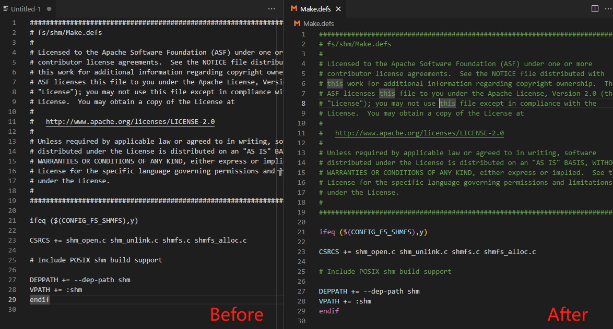

# NuttX Dev Pack

 

This pack just want to make nuttx developper's work easier. Build tools for ourselves. Welcome any comment.

致力于改善 NuttX 相关开发体验，欢迎共建。

This tool is not officially operated by the NuttX team.

本工具非 NuttX 团队官方运营。

# Installation 安装方法

- Search NuttX Dev Pack in extension marketplace and install it
- Use command palette to run "nuttx-dev-pack.run", the extension will do things for you to develop NuttX easier.

# Feature 功能

## Care about Makefile 优化 Makefile 相关体验

- Makefile support, 基本 Makefile 功能开发支持，fucntion provided by [Makefile Tools](https://marketplace.visualstudio.com/items?itemName=ms-vscode.makefile-tools)  
- By default, only Makefile is in makefile language mode. Make *.defs default to makefile language mode also.
- 默认增加 .defs 后缀文件也以 makefile 的模式打开

## Care about Kconfig 优化 Kconfig 相关体验

- Highlight Kconfig file, 高亮显示 Kconfig 文件，fucntion provided by [kconfig](https://marketplace.visualstudio.com/items?itemName=luveti.kconfig) 

## Care about git 优化 Git 相关体验

- Enable git signoff by default in workspace，默认在 VS Code 的 Workspace 范围内开启 git.alwaysSignOff 开关

## Care about python to develop tools, 优化 Python 相关体验方便开发工具

- Provide some snippets，添加部分 Python 代码 Snippets

## Other
- Align related
  - [Better Align](https://marketplace.visualstudio.com/items?itemName=Chouzz.vscode-better-align) 
- Bookmarks related
  - [Bookmarks](https://marketplace.visualstudio.com/items?itemName=alefragnani.bookmarks) 
- Other ……